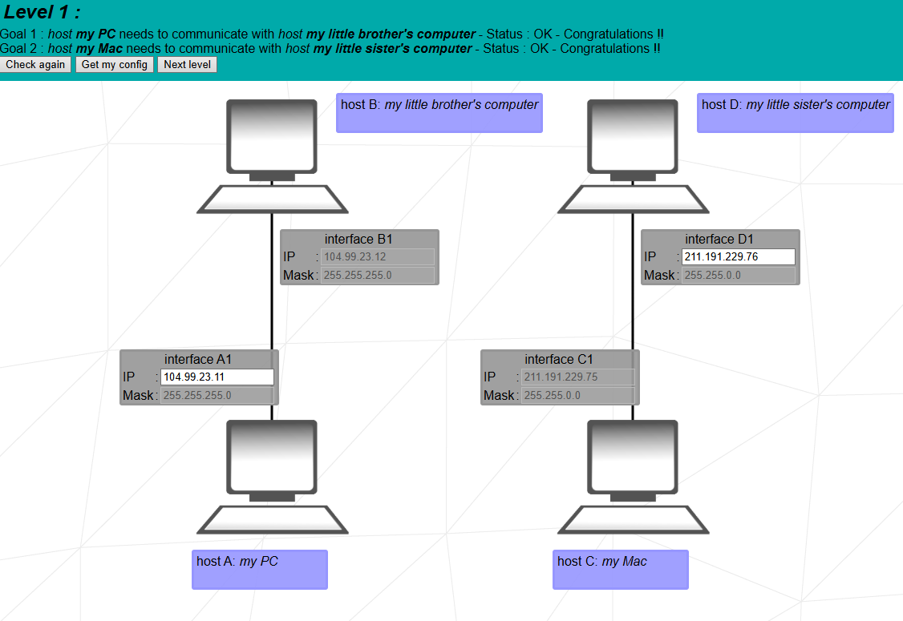
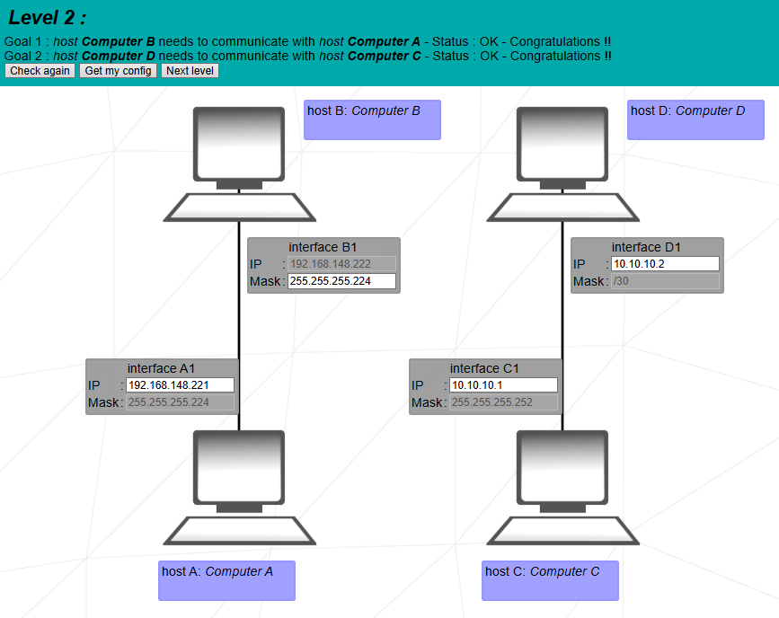
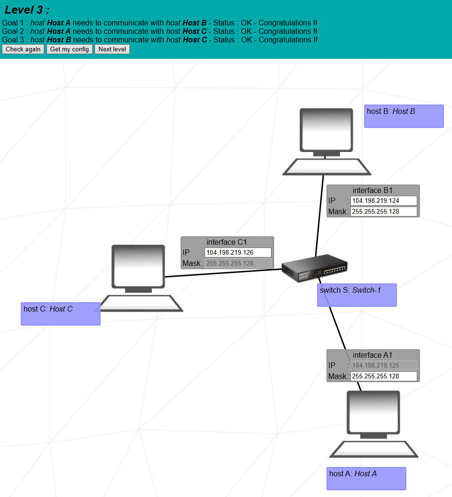
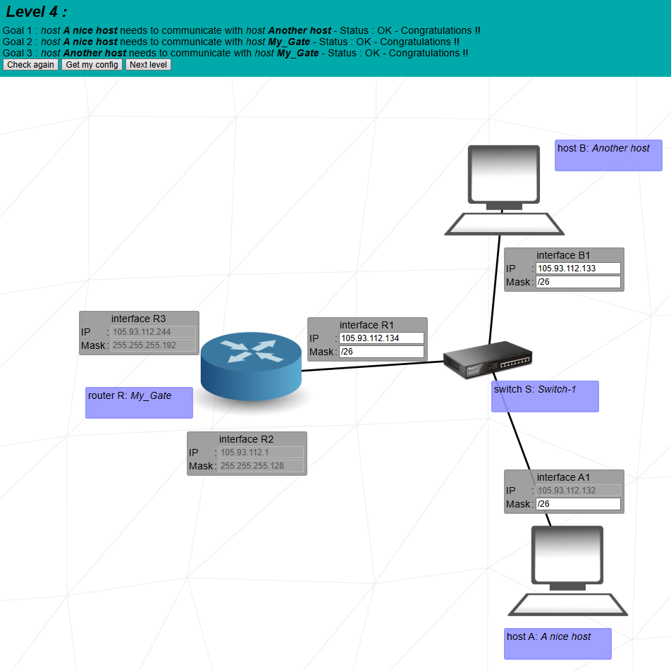
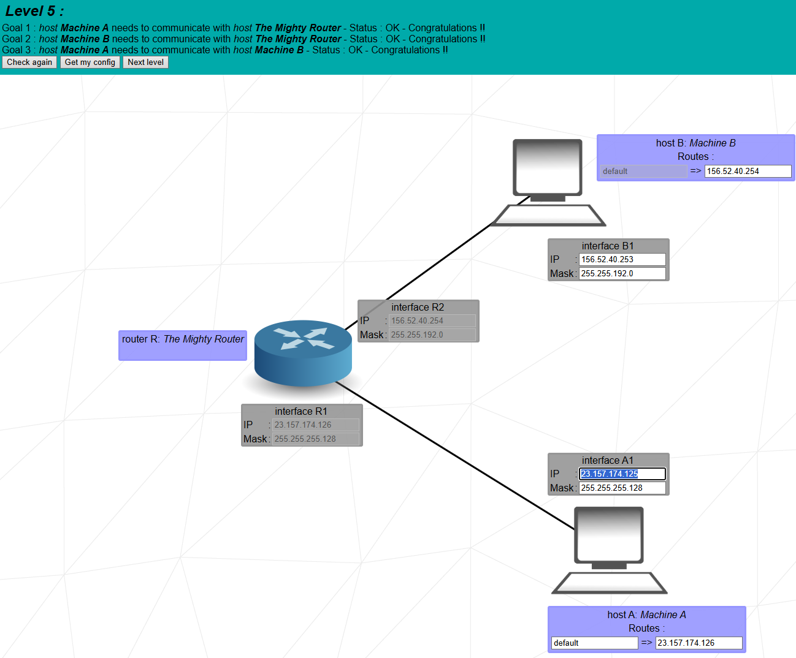
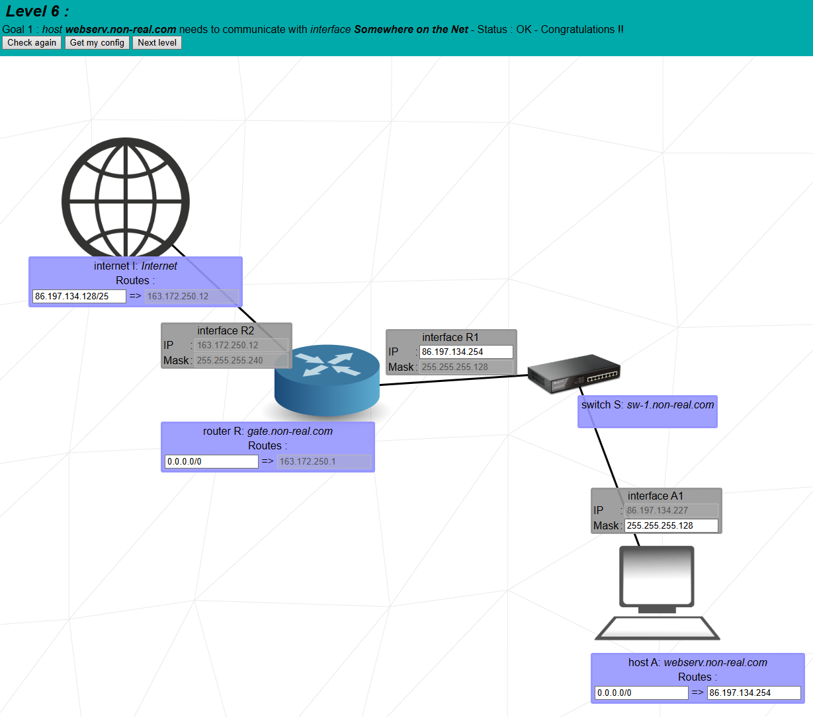
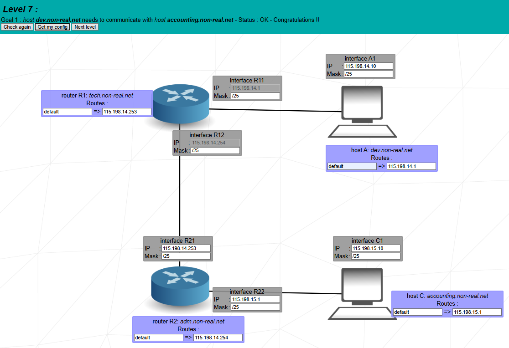
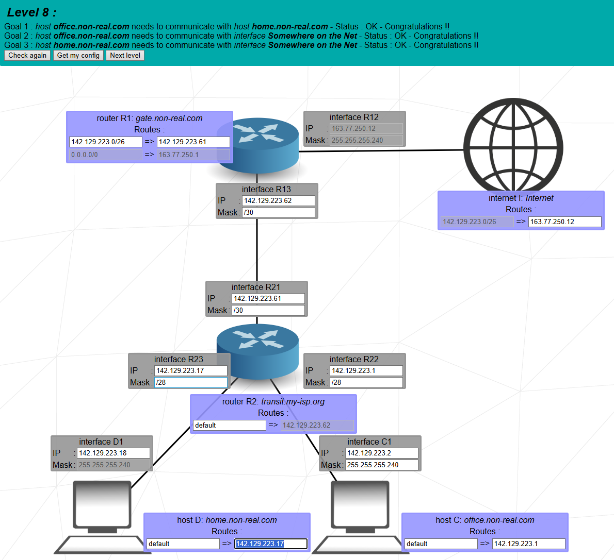
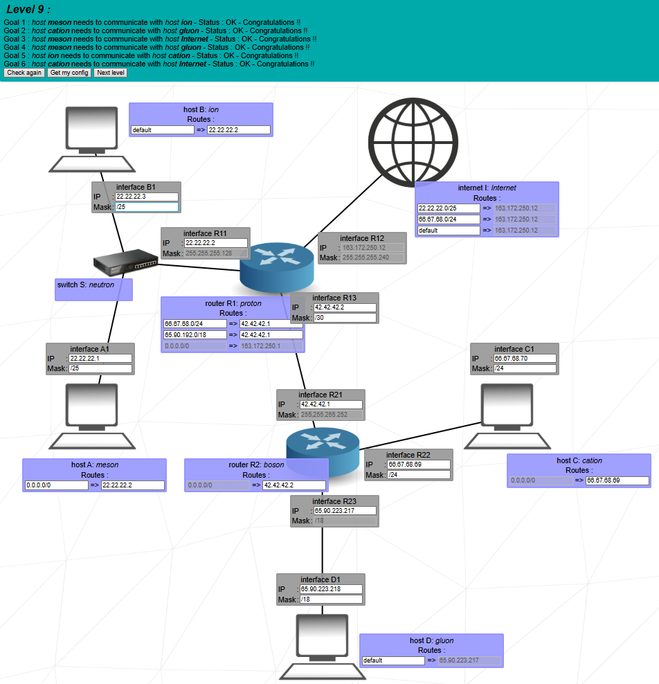
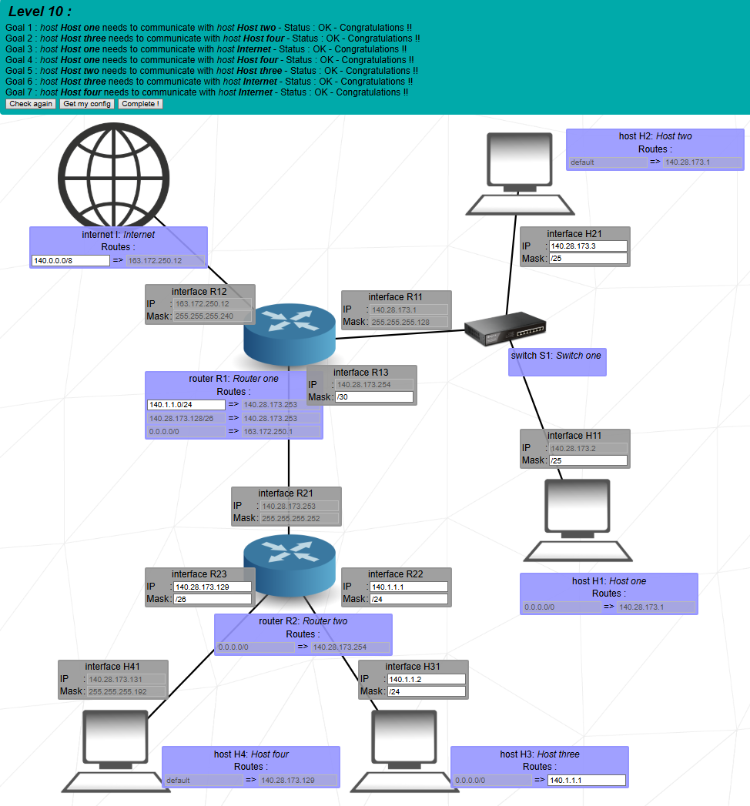

# netPractice
NetPractice project @ school 42

## Things to know

*   An IP address (IPv4) is a 32-bit binary number, most often represented in dotted-decimal notation. This means the four sets of 8 bits (octets) are represented as decimal numbers separated by periods (`.`).
    *   **Address:** `10.11.12.13` == `00001010.00001011.00001100.00001101`

*   To simplify IP network management and interconnection, subnetworks (or subnets) are used.

*   A subnetwork is a logical subdivision of an IP network where the first 'x' bits of an address are fixed, and the last '32-x' bits can vary.

*   You can get a glimpse of subnets with the `ipcalc` command or similar online tools. For example, the IP address [10.11.12.13/28](https://jodies.de/ipcalc?host=10.11.12.13&mask1=28&mask2=) has the first 28 bits fixed, and the last 4 bits can vary from `0000` to `1111` (or 0 to 15 in decimal). In this subnet, you can have 14 hosts, with the minimum host address being `10.11.12.1` and the maximum being `10.11.12.14`. When all the variable bits are 0, that is the subnetwork address (`Network: 10.11.12.0/28`), and when all the variable bits are 1, that is the broadcast address (`Broadcast: 10.11.12.15`). These two addresses cannot be assigned to IP interfaces within this subnetwork.

*   The netmask is a 32-bit binary number where the bits corresponding to the fixed network portion are set to 1, and the rest are set to 0.
    *   **Netmask:** `255.255.255.240` = `/28` `11111111.11111111.11111111.11110000`
    *   The netmask should be the same on both ends of an IP link.

*   A router is responsible for distributing IP packets to other networks and hosts. If an incoming packet belongs to a subnetwork to which the router has a direct connection, the packet will be routed there. Otherwise, the packet will be forwarded toward the next-hop IP address specified in the router's routing table.

*   **Note**: Unfortunately `ipcalc` is not available at 42 school computers and only the `bc` basic calculator can be used at evaluation/exam. This has very limited functionality, but we can convert from decimal to binary and from binary to decimal:

```bash
neat@dellw:/mnt/c/Users/dajcs/code/netPractice$ echo "obase=2; 192;168;148;222" | bc
11000000
10101000
10010100
11011110
neat@dellw:/mnt/c/Users/dajcs/code/netPractice$ echo "ibase=2; 11000000;10101000;10010100;11011110" | bc
192
168
148
222
```
---

## Level 1

Just select Ip address with 1 greater or smaller than the other end of the Ip link:


<p align="center">

</p>

---

## Level 2

For `Computer A` and `Computer B` we set the same subnetwork 255.255.255.224 (or /27) and we check HostMin and HostMax for this subnetwork.

```yaml
neat@dellw:/mnt/c/Users/dajcs/code/netPractice$ ipcalc 192.168.148.222 255.255.255.224
Address:   192.168.148.222      11000000.10101000.10010100.110 11110
Netmask:   255.255.255.224 = 27 11111111.11111111.11111111.111 00000
Wildcard:  0.0.0.31             00000000.00000000.00000000.000 11111
=>
Network:   192.168.148.192/27   11000000.10101000.10010100.110 00000
HostMin:   192.168.148.193      11000000.10101000.10010100.110 00001
HostMax:   192.168.148.222      11000000.10101000.10010100.110 11110
Broadcast: 192.168.148.223      11000000.10101000.10010100.110 11111
Hosts/Net: 30                    Class C, Private Internet
```

Since HostMax ends in 222, we should set 221 in interface `A1`.

On `Computer C` and `Computer D` connection the 127.x.y.z should be changed, because that is a loopback Ip address.
We have the mask fixed to 255.255.255.252 (or /30) and that means the the last two bits of the Ip addresses needs to end in 01 and 10.

```yaml
neat@dellw:/mnt/c/Users/dajcs/code/netPractice$ ipcalc 10.0.0.1 /30
Address:   10.0.0.1             00001010.00000000.00000000.000000 01
Netmask:   255.255.255.252 = 30 11111111.11111111.11111111.111111 00
Wildcard:  0.0.0.3              00000000.00000000.00000000.000000 11
=>
Network:   10.0.0.0/30          00001010.00000000.00000000.000000 00
HostMin:   10.0.0.1             00001010.00000000.00000000.000000 01
HostMax:   10.0.0.2             00001010.00000000.00000000.000000 10
Broadcast: 10.0.0.3             00001010.00000000.00000000.000000 11
Hosts/Net: 2                     Class A, Private Internet
```


<p align="center">

</p>

---

## Level 3

The switch is connecting all three hosts, so we need to set them in the same subnetwork. We set the mask to 255.255.255.128 (/25) and we check for HostMin and HostMax:

```yaml
neat@dellw:/mnt/c/Users/dajcs/code/netPractice$ ipcalc 104.198.219.125 255.255.255.128
Address:   104.198.219.125      01101000.11000110.11011011.0 1111101
Netmask:   255.255.255.128 = 25 11111111.11111111.11111111.1 0000000
Wildcard:  0.0.0.127            00000000.00000000.00000000.0 1111111
=>
Network:   104.198.219.0/25     01101000.11000110.11011011.0 0000000
HostMin:   104.198.219.1        01101000.11000110.11011011.0 0000001
HostMax:   104.198.219.126      01101000.11000110.11011011.0 1111110
```

Since HostMax ends in 126, we can give this to one of the interfaces, .125 already taken and for the remaining interface we can give address ending in .124


<p align="center">

</p>

---

## Level 4

We have the `router My_Gate` with `R2` and `R3` interfaces fixed to 105.93.112.1/25 and 105.93.112.244/26.

```yaml
neat@dellw:/mnt/c/Users/dajcs/code/netPractice$ ipcalc 105.93.112.1 255.255.255.128
Address:   105.93.112.1         01101001.01011101.01110000.0 0000001
Netmask:   255.255.255.128 = 25 11111111.11111111.11111111.1 0000000
Wildcard:  0.0.0.127            00000000.00000000.00000000.0 1111111
=>
Network:   105.93.112.0/25      01101001.01011101.01110000.0 0000000
HostMin:   105.93.112.1         01101001.01011101.01110000.0 0000001
HostMax:   105.93.112.126       01101001.01011101.01110000.0 1111110
Broadcast: 105.93.112.127       01101001.01011101.01110000.0 1111111
Hosts/Net: 126                   Class A

neat@dellw:/mnt/c/Users/dajcs/code/netPractice$ ipcalc 105.93.112.244 255.255.255.192
Address:   105.93.112.244       01101001.01011101.01110000.11 110100
Netmask:   255.255.255.192 = 26 11111111.11111111.11111111.11 000000
Wildcard:  0.0.0.63             00000000.00000000.00000000.00 111111
=>
Network:   105.93.112.192/26    01101001.01011101.01110000.11 000000
HostMin:   105.93.112.193       01101001.01011101.01110000.11 000001
HostMax:   105.93.112.254       01101001.01011101.01110000.11 111110
Broadcast: 105.93.112.255       01101001.01011101.01110000.11 111111
Hosts/Net: 62                    Class A
```

We have to avoid overlapping subnetworks on the router interfaces, and `host A` if `A1` Ip is set to 105.93.112.132, so we can choose here a /26 subnetwork (we could make it even smaller /27, /28 or /29), and set if `B1` to .133 and `R1` to .134

```yaml
neat@dellw:/mnt/c/Users/dajcs/code/netPractice$ ipcalc 105.93.112.132 /26
Address:   105.93.112.132       01101001.01011101.01110000.10 000100
Netmask:   255.255.255.192 = 26 11111111.11111111.11111111.11 000000
Wildcard:  0.0.0.63             00000000.00000000.00000000.00 111111
=>
Network:   105.93.112.128/26    01101001.01011101.01110000.10 000000
HostMin:   105.93.112.129       01101001.01011101.01110000.10 000001
HostMax:   105.93.112.190       01101001.01011101.01110000.10 111110
Broadcast: 105.93.112.191       01101001.01011101.01110000.10 111111
Hosts/Net: 62                    Class A
```


<p align="center">

</p>

---

---

## Level 5

- **Step1**: make the subnet masks equal on the two ends of the ip link:
  - `router R` <=> `host A`: mask = 255.255.255.128
  - `router R` <=> `host B`: mask = 255.255.192.0
- **Step2**: make sure the IP addresses on one connection are from the same subnet, e.g., with `ipcalc`, the Ip Adress should be >= than `HostMin` and <= than `HostMax` and the Ip Adresses should be different from the other end of the connection.
  ```yaml
  # router R <=> host A
  neat@dellw:/mnt/c/Users/dajcs/code/netPractice$ ipcalc 23.157.174.126 255.255.255.128
  Address:   23.157.174.126       00010111.10011101.10101110.0 1111110
  Netmask:   255.255.255.128 = 25 11111111.11111111.11111111.1 0000000
  Wildcard:  0.0.0.127            00000000.00000000.00000000.0 1111111
  =>
  Network:   23.157.174.0/25      00010111.10011101.10101110.0 0000000
  HostMin:   23.157.174.1         00010111.10011101.10101110.0 0000001
  HostMax:   23.157.174.126       00010111.10011101.10101110.0 1111110
  Broadcast: 23.157.174.127       00010111.10011101.10101110.0 1111111
  Hosts/Net: 126                   Class A
  # host A should have IP > HostMin and < HostMax and != 23.157.174.126

  # router R <=> host B
  neat@dellw:/mnt/c/Users/dajcs/code/netPractice$ ipcalc 156.52.40.254 255.255.192.0
  Address:   156.52.40.254        10011100.00110100.00 101000.11111110
  Netmask:   255.255.192.0 = 18   11111111.11111111.11 000000.00000000
  Wildcard:  0.0.63.255           00000000.00000000.00 111111.11111111
  =>
  Network:   156.52.0.0/18        10011100.00110100.00 000000.00000000
  HostMin:   156.52.0.1           10011100.00110100.00 000000.00000001
  HostMax:   156.52.63.254        10011100.00110100.00 111111.11111110
  Broadcast: 156.52.63.255        10011100.00110100.00 111111.11111111
  Hosts/Net: 16382                 Class B
  # host B should have IP > HostMin and < HostMax and != 156.52.40.254
  ```
- **Step3**: both `host A` and `host B` have only 1 connection => the default router should point to the next hop, that means to the Ip address on the other end of their connection (the `router R` interface Ip address)

<p align="center">

</p>

---

## Level 6

- **Step1**: Equal netmasks => `host A` mask = 255.255.255.128
- **Step2**: Ip addr on same subnet =>
  ```yaml
  neat@dellw:/mnt/c/Users/dajcs/code/netPractice$ ipcalc 86.197.134.227 255.255.255.128
  Address:   86.197.134.227       01010110.11000101.10000110.1 1100011
  Netmask:   255.255.255.128 = 25 11111111.11111111.11111111.1 0000000
  Wildcard:  0.0.0.127            00000000.00000000.00000000.0 1111111
  =>
  Network:   86.197.134.128/25    01010110.11000101.10000110.1 0000000
  HostMin:   86.197.134.129       01010110.11000101.10000110.1 0000001
  HostMax:   86.197.134.254       01010110.11000101.10000110.1 1111110
  Broadcast: 86.197.134.255       01010110.11000101.10000110.1 1111111
  Hosts/Net: 126                   Class A
  ```
  => Ip Addr 86.197.134.254 is ok for `router R` - `R1` interface.
- **Step 3**:
  - `host A` should have default route (`default` or `0.0.0.0/0`) pointing to `router R` Ip addr 86.197.134.254
  - `router R` has two interfaces `R1` connected to `host A` and `R2` connected to the internet (163.172.250.12/28). In the routing table it has a single entry pointing to an interface on the internet (163.172.250.1). We should make this entry a default route, so we'll have `router R` Routes: 0.0.0.0/0 => 163.172.250.1  \
  When a packet is coming from the internet towards `host A` Ip addr 86.197.134.227 first we should set the routing entry on the Internet server. This could work: 86.197.134.227/32 => 163.172.250.12 in the exam, since it doesn't need too much computation. However this is not a nice solution, because it means that if we plug in another computer in the switch that won't be able to connect to the internet. So the nice solution is to direct the whole network 86.197.134.128/25 from the previous `ipcalc` results towards the `router R1` interface `R2`.  \
  **Note**: When a packet is coming from the internet towards `host A` in `router R`, that is not analyzed by the routing table, because the router's `R1` interface is on the 86.197.134.128/25 subnet, so the router knows that the packet should be forwarded there without consulting the routing table.

<p align="center">

</p>
---

## Level 7

- **Step1**: `router R1` has two interfaces: `R11` with Ip 115.198.14.1 and interface `R12` with Ip 115.198.14.254  \
We are putting these interfaces in different subnets, so we can't use a /24 subnet. The next logical choice is a /25 subnet.
- **host A**:
  - Mask: /25 (should be the same like if `R11`)
  - Ip: 115.198.14.10 (could be anything from .2 up to .127)
  - Route: default => 115.198.14.1 (`R11` Ip)
- **router R1**:
  - Masks: /25 (as per Step 1)
- **router R2**:
  - if `R21` (same subnet like `R12`)
    - Ip: 115.198.14.253
    - Mask: /25
  - if `R22` (a new /25 subnet)
    - Ip: 115.198.15.1
    - Mask: /25
  - Route: default => 115.198.14.254 (`R12` Ip)
- **router R1**:
  - Route: default => 115.198.14.253 (`R21` Ip)
- **host C**:
  - Ip: 115.198.15.10 (could be anything from .2 up to .127)
  - Mask: /25
  - Route: default => 115.198.15.1 (`R22` Ip)


<p align="center">

</p>

---

## Level 8

- **Internet**: On the Internet we have a routing table with a fixed entry. We should make this entry to point the the `R12` interface Ip: 142.129.223.0/26 => 163.77.250.12
- **router R2**: We have a routing table entry pointing to address 142.129.223.62. We should make this the default route, so that when a random Ip is sent from `host C` or `host D` these packets are diverted towards the Internet, and Ip packets coming from the Internet will be distributed by direct subnetwork connection towards `host C` and `host D`.
  - Route: default => 142.129.223.62  (default is the same as 0.0.0.0/0)
- **router R1**: The interface `R13` Ip address is specified in the `router R2` default route entry, and we choose a netmask of /30, which allows two Ip addresses on the router interconnection link.
  - if `R13`:
    - Ip: 142.129.223.62
    - Mask: /30
- **router R1**: The routing table has a fixed default route entry 0.0.0.0/0 => 163.77.250.1 - this address is likely the Internet server Ip address connected to interface `R12`. So outgoing traffic is ok, we should add a route entry for the incomming traffic from the Internet. We should route the same Ip address range as specified in the internet (142.129.223.0/26) towards the `router R2` interface `R21`, which will have Ip 142.129.223.61 (because of the /30 mask on if `R13`)
  - Route: 142.129.223.0/26 => 142.129.223.61
- **router R2**: We should split the ip range 142.129.223.0/26 coming from the internet in two smaller subnetworks, one for `host C` and one for `host D`. We could split in [two](https://jodies.de/ipcalc?host=142.129.223.0&mask1=26&mask2=27): but then we whould have a problem: the Ip addresses used for the router interconnection it would belong to one of the subnets. If we want a clean solution, we need to split the range in [four /28 subnets](https://jodies.de/ipcalc?host=142.129.223.0&mask1=26&mask2=28) and we are going to use Network:   142.129.223.0/28 for `host C` and Network:   142.129.223.16/28 for `host D`.
  - if `R22`:
    - Ip: 142.129.223.1
    - Mask: /28
  - if `R23`:
    - Ip: 142.129.223.17
    - Mask: /28
- **host C**:
  - if `C1`:
    - Ip: 142.129.223.2
    - Mask: 255.255.255.240
    - Route: default => 142.129.223.1
- **host D**:
  - if `D1`:
    - Ip: 142.129.223.18
    - Mask: /28 (255.255.255.240)
    - Route: default => 142.129.223.17

<p align="center">

</p>

---

## Level 9

This looks more complicated: we have 4 hosts which should communicate with each other, two of them need to reach the Internet and we have two routers. On the other hand it is easier, because we have very few fixed settings, so we can choose our Ip-s and masks.

One important thing: if a host has to reach the internet, then it shouldn't use one of the [private/reserved Ip addresses](https://en.wikipedia.org/wiki/Reserved_IP_addresses). Rule of thumb: avoid Ip addresses starting with 10 or 172 or 192.

Hint: clear all fields to be sure when a field is set that is for a good reason.

- **host D**:
  - Route: default => 65.90.223.217

- **router R2**:
  - if `R23`:
    - Ip: 65.90.223.217
    - Mask: /18

- **host D**:
  - if `D1`:
    - Ip: 65.90.223.218
    - Mask: /18

- **host C**:  \
We can choose any public Ip, since we used 65.x.y.z on `host D`, let's go with 66.x.y.z here
  - Route: 0.0.0.0/0 => 66.67.68.69
  - Ip: 66.67.68.70
  - Mask: /24

- **router R2**:
  - if `R22`:
    - Ip: 66.67.68.69
    - Mask: /24

The `router R2` and `router R1` interconnection link can have any Ip address, but the netmask is given /30. This netmask allows only two Ip addresses for a given subnetwork, and we should make sure that converted to binary the last two bits are 01 or 10. The default route should point to the Internet, and the packets coming from the internet will be forwarded by direct subnetwork connection.

- **router R2**:
  - if `R21`:
    - Ip: 42.42.42.1
    - Mask: /30 (255.255.255.252)
  - Route: 0.0.0.0/0 => 42.42.42.2

- **router R1**:
  - if `R13`:
    - Ip: 42.42.42.2
    - Mask: /30

On `host A` and `host B` we are free to choose the Ip-s, the only restriction comes from `router R1` interface `R11` which has Mask /25.

- **host A**:
  - Ip: 22.22.22.1
  - Mask: /25
  - Route: default => 22.22.22.2

- **router R1**:
  - if `R11`:
    - Ip: 22.22.22.2
    - Mask: /25 (255.255.255.128)

- **host B**:
  - Ip: 22.22.22.3
  - Mask: /25
  - Route: default => 22.22.22.2

The `router R1` has a default route towards the Internet. The incoming packets from the internet will be forwarded towards `host A` and `host B` by direct subnetwork connection, so we need to add two routes towards `host C` and `host D` which have as next hop the `router R2`.

- **router R1**:
  - Routes:
    - 66.67.68.0/24 => 42.42.42.1
    - 65.90.192.0/18 => 42.42.42.1
    - 0.0.0.0/0 => 163.172.250.1 (towards Internet, given)

On the Internet we need to set the reverse routes towards `host A` and `host C`through `router R2`.

- **Internet**:
  - Routes:
    - 22.22.22.0/25 => 163.172.250.12
    - 66.67.68.0/24 => 163.172.250.12
    - default => 163.172.250.12


<p align="center">

</p>

---

## Level 10

Here we have again a complex network but there more fixed settings. The Internet server will not accept a route entry default => 163.172.250.12 (towards `router R1`) for the reverse way, so we are going to our subnetwork 140.0.0.0/8

- **Internet**:
  - Route: 140.0.0.0/8 => 163.172.250.12

For `Host 1` we only need to set the subnetwork mask, which is going to match if `R11` mask:

- **Host 1**:
  - Mask: /25

- **Host 2**:
  - Ip: 140.28.173.3
  - Mask: /25

The `router R2` if `R23` is determined by `Host 4` and on if `R22` we choose freely a different subnetwork.

- **router R2**:
  - if `R23`:
    - Ip: 140.28.173.129
    - Mask: /26
  - if `R22`:
    - Ip: 140.1.1.1
    - Mask: /24

- **Host 3**:
  - Ip: 140.1.1.2
  - Mask: /24
  - Route: 140.1.1.1

On `router R1` if `R13` mask should be equal with if `R21` mask, and we should add a route entry towards `Host 3`.

- **router R1**:
  - if `R13`:
    - Ip: 14.28.173.254 (fixed)
    - Mask: /30
  - Routes:
    - 140.1.1.0/24 => 140.28.173.253


<p align="center">

</p>

---


